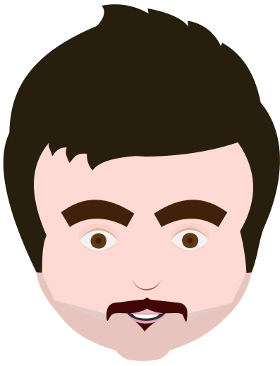

 

    
    
    
    

# Gonjeshk HTML5 Landing

The **Gonjeshk HTML5 Landing** is simple HTML5 & CSS3 landing page for a personal website. 

## Live Demo
Live demo on [aynzad.github.io/gonjeshk-html5-landing/](https://aynzad.github.io/gonjeshk-html5-landing/).

## Contributing

Great that you are considering supporting the project. You have a lot of ways to help me grow. I appreciate all contributions, even the smallest.

- Report an issue.
- Propose a feature.
- Send a pull request.
- Star project on the [GitHub](https://github.com/aynzad/gonjeshk-html5-landing)
- Tell about project around your community.

## License

It is licensed under the [MIT license](http://opensource.org/licenses/MIT).
